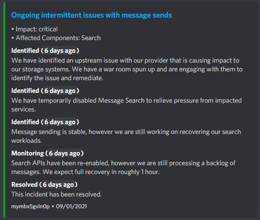
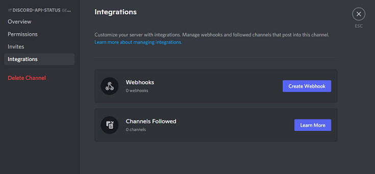
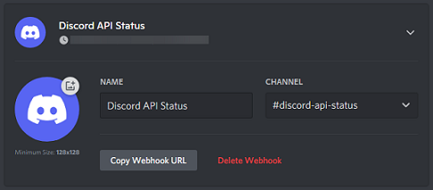

# Discord API Status Webhook

### Table of Contents
1. [Introduction](#introduction)
2. [Getting started](#getting-started)
3. [Creating a webhook](#creating-a-webhook)
4. [Configuration](#configuration)
5. [Run it!](#run-it)

## Introduction
This project uses the [discord.js](https://github.com/discordjs/discord.js) library to create a webhook which can display past and current status-changes of the official Discord API.
The information is taken from [discordstatus.com](https://discordstatus.com/), the official Discord API's status page.

The resulting messages look like this:


## Getting started
Clone this repository by running the following commands:
```shell
git clone https://github.com/Laennart/discord-api-status-webhook.git
cd discord-api-status-webhook/
```

## Creating a webhook
1. Navigate to your discord server and choose a channel where you want the updates to be displayed.
2. Go into the channels settings and navigate to the Integrations menu.

3. Click on "Create Webhook", give it a name and save your changes.

4. Copy the Webhook URL into the [config](#configuration) file.

## Configuration
Before you can start using the webhook you have to create a `config.json` file in the root directory of the project. Now paste your Webhook URL into the config file.
```json
{
  "url": "Webhook-Url",
  "ignoreDays": 30
}
```

## Run it!
Now we can start the webhook by typing `npm run start` into the terminal. For future use you could set up a script to run the webhook periodically (e.g. with chron).
